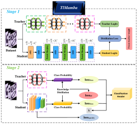

# TlMamba

TlMamba is the final release package for handwritten character recognition in ancient Tai palm-leaf manuscripts. It includes model code, a training entry point, an evaluation script, an architecture figure, and fixed experimental settings.

The dataset and weight files are distributed separately via Baidu Netdisk and are not included in this GitHub repository.

<p align="center">
  
</p>

## Directory Structure

```text
TlMamba_release/
|-- assets/
|   `-- Fig3_TlMamba_Model_Architecture.svg
|-- data/
|   |-- HLDLC1.0/
|   |   |-- train/
|   |   |-- val/
|   |   `-- test/
|   `-- <other_datasets>/
|       |-- train/
|       |-- val/
|       `-- test/
|-- models/
|   |-- TSKD_train.py
|   |-- revision_ablation_models.py
|   |-- MedMamba.py
|   |-- MedMamba_PConv.py
|   |-- MedMamba_PConv_CFBlock.py
|   |-- TlMamba.py
|   `-- PConv.py
|-- weights/
|-- outputs/
|   `-- hldlc/
|       `-- tlmamba_full_hldlc.json
|-- test.py
|-- requirements.txt
|-- README.md
`-- README_EN.md
```

## Environment Setup

The release package has been validated in the following CUDA environment: Python 3.10.19, PyTorch 2.2.1+cu121, and torchvision 0.17.1+cu121. You can install PyTorch first and then install the remaining dependencies:

```bash
pip install torch==2.2.1 torchvision==0.17.1 torchaudio==2.2.1 --index-url https://download.pytorch.org/whl/cu121
pip install -r requirements.txt
```

`mamba_ssm`, `causal_conv1d`, or `selective_scan` must match the local CUDA, PyTorch, and Python versions. If you use locally prebuilt wheels, install the matching wheels after installing `requirements.txt`.

## Dataset and Weights

This project focuses on handwritten character recognition in ancient Tai palm-leaf manuscripts. The core dataset, `HLDLC1.0`, targets low-resource, long-tailed, and fine-grained character-confusion scenarios, and supports the main experiments, ablation studies, and long-tailed recognition comparisons in the paper.

The GitHub repository does not include the dataset or weight archives. Download them from the Baidu Netdisk links below and prepare the files as follows:

```text
extract the TlMamba checkpoint to weights/tlmamba_full_hldlc.pth
extract the HLDLC1.0 dataset to data/HLDLC1.0/
```

| Type | Name | Target Directory | Download |
| --- | --- | --- | --- |
| Dataset | HLDLC1.0.zip | `data/HLDLC1.0/` | [Baidu Netdisk](https://pan.baidu.com/s/1Lvm2s1NzC_5y52wuMv4Kmg?pwd=xp2r) `pwd: xp2r` |
| Weight | TlMamba_HLDLC.zip | `weights/` | [Baidu Netdisk](https://pan.baidu.com/s/15ACFI6plxAeWxDq1xvJbDg?pwd=uj2s) `pwd: uj2s` |

Basic information for HLDLC1.0:

```text
task: ancient Tai palm-leaf manuscript handwritten character recognition
classes: 51
total samples: 3,739
format: ImageFolder
distribution: low-resource and long-tailed character classification
overall class-count range: 10-100 samples per class
train class-count range: 6-58 samples per class
protocol: fixed train/val/test split; early stopping monitors val; final results are reported on test
```

Fixed split of HLDLC1.0:

```text
train: 1,831
val:   786
test:  1,122
```

Directory layout:

```text
data/HLDLC1.0/train/<class_name>/
data/HLDLC1.0/val/<class_name>/
data/HLDLC1.0/test/<class_name>/
```

## Dataset and Benchmark

`HLDLC1.0` is the core benchmark dataset of this repository. The release is organized around a fixed split, a unified training entry point, and unified evaluation outputs, making it easier to reproduce experimental results and compare future methods under the same protocol.

Benchmark:

```text
- main recognition benchmark on HLDLC1.0
- ablation and long-tailed comparison under the released split
```

Protocol:

```text
- use the released HLDLC1.0 train/val/test split without re-splitting
- monitor validation performance for early stopping and checkpoint selection
- report final metrics on the test split
- keep data format, class folders, and evaluation pipeline consistent across methods
```

Metrics:

```text
Accuracy
Macro Precision
Macro Recall
Macro F1
Balanced Accuracy
```

## Third-Party Public Datasets

The third-party public datasets used in the supplementary experiments are used to evaluate generalization in other manuscript-character or historical-document character recognition scenarios. These datasets are not redistributed with this repository or through Baidu Netdisk. Please obtain them from their original release pages and follow their licenses, citation requirements, and usage terms.

| Name | Original Source | Project Directory |
| --- | --- | --- |
| AMADI_LontarSet | [AMADI_LontarSet publication](https://www.researchgate.net/publication/309430549_AMADI_LontarSet_The_First_Handwritten_Balinese_Palm_Leaf_Manuscripts_Dataset) | `data/AMADI_LontarSet/` |
| SleukRith | [SleukRith-Set repository](https://github.com/donavaly/SleukRith-Set) | `data/SleukRith/` |
| Kuzushiji-Ogihan | [Hugging Face dataset](https://huggingface.co/datasets/DimV-Ai/kuzushiji-character-dataset-ogihan-v1) | `data/Kuzushiji-Ogihan/` |

This release entry point reads supplementary datasets in `ImageFolder` format. When using third-party public datasets, first organize or convert them into the following structure:

```text
data/<dataset>/train/<class_name>/
data/<dataset>/val/<class_name>/
data/<dataset>/test/<class_name>/
```

Supplementary dataset usage:

```text
AMADI_LontarSet: Balinese palm-leaf manuscript character recognition
SleukRith: Khmer manuscript character recognition
Kuzushiji-Ogihan: historical Japanese character recognition
```

## Training

Training entry point:

```bash
python models/TSKD_train.py
```

The default configuration of `tlmamba_full` uses `seed 42`, AdamW, cosine learning-rate scheduling, AMP, Mixup/CutMix, physical batch size `32`, and gradient accumulation `4`, giving an effective batch size of `128`.

HLDLC1.0:

```bash
python models/TSKD_train.py \
  --dataset hldlc \
  --method tlmamba_full \
  --batch-size 32 \
  --accumulation-steps 4 \
  --epochs 200 \
  --min-epochs 20 \
  --early-stopping-patience 15 \
  --seed 42 \
  --lr 1e-4 \
  --weight-decay 0.05 \
  --scheduler-t-max 200 \
  --amp \
  --release-setting
```

Common configuration candidates:

```text
--dataset    hldlc
--method     tlmamba_full / mambavision / vision_mamba / pure_mamba / fastvit
--method     focal_loss / class_balanced_loss / ldam / balanced_softmax / crt
--seed       42
```

If the model name differs in your local `timm` installation, use `--timm-name` to specify the actual model name.

## Long-Tailed Methods

Long-tailed class experiments use the same command template as HLDLC1.0 and only replace `--method`:

```text
focal_loss
class_balanced_loss
ldam
balanced_softmax
crt
```

Example:

```bash
python models/TSKD_train.py \
  --dataset hldlc \
  --method ldam \
  --batch-size 32 \
  --accumulation-steps 4 \
  --epochs 200 \
  --min-epochs 20 \
  --early-stopping-patience 15 \
  --seed 42 \
  --lr 1e-4 \
  --weight-decay 0.05 \
  --scheduler-t-max 200 \
  --amp \
  --release-setting
```

## Supplementary Manuscript Datasets

Dataset candidates:

```text
AMADI_LontarSet
SleukRith
Kuzushiji-Ogihan
```

Model candidates:

```text
tlmamba_full
resnet18
densenet121
efficientnet
swintransformer
fastervit
mambavision
```

Command template:

```bash
python models/TSKD_train.py \
  --dataset <dataset_name> \
  --method <method_name> \
  --batch-size 32 \
  --accumulation-steps 4 \
  --epochs 200 \
  --min-epochs 20 \
  --early-stopping-patience 15 \
  --seed 42 \
  --lr 1e-4 \
  --weight-decay 0.05 \
  --scheduler-t-max 200 \
  --amp \
  --release-setting
```

## Evaluation

Use `test.py` to evaluate a specified checkpoint. Before running evaluation, make sure the weight file is available at `weights/tlmamba_full_hldlc.pth` and the dataset has been extracted to `data/HLDLC1.0/`:

```bash
python test.py \
  --dataset hldlc \
  --model tlmamba \
  --weights weights/tlmamba_full_hldlc.pth \
  --output outputs/hldlc/tlmamba_full_hldlc.json
```

The evaluation results include Accuracy, Macro Precision, Macro Recall, Macro F1, and a confusion matrix.

## Output Files

After training, results are saved by default under:

```text
outputs/<dataset>/<method>_bs<batch-size>_acc<accumulation-steps>_seed<seed>/
|-- best.pth
|-- last.pth
|-- class_indices.json
`-- history.json
```

## Citation

```bibtex
@article{tlmamba2026,
  title   = {TlMamba: Enhancing Ancient Tai Palm-Leaf Manuscript Character Recognition through Hybrid Vision Mamba Framework},
  author  = {Zhao, Jingying},
  journal = {The Visual Computer},
  year    = {2026}
}
```

The citation information will be updated after the formal paper is published.
